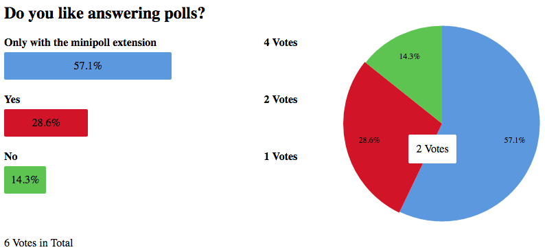

.. include:: ../Includes.txt

.. _section-introduction:

Introduction
============

.. _section-what-it-does:

What does it do?
----------------

This extension brings polls to TYPO3. It is designed for easy use and brings a
small but powerful set of features.

.. _section-screenshots

Screenshots
-----------

   View of poll results (default style)

.. _section-features:

Feature list
------------

* Create polls with as many answers as needed
* Allow one or more answers
* Selectable duplication checks ("Cookie", "IP address" and "Frontend User")
* Online-states (open/closed or time-based)
* Captcha support
* Simple but nice default style
* Templating with fluid
* Configuration with Flexforms/Typoscript
* Interfaces for third party applications

.. _section-credits:

Credits
-------

Thanks to the `Agentur am Wasser <https://web.agenturamwasser.ch/>`_, our
company, for giving us the possibility to realize this extension and share it
with the TYPO3 community.
