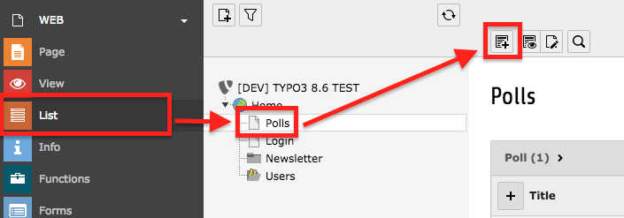
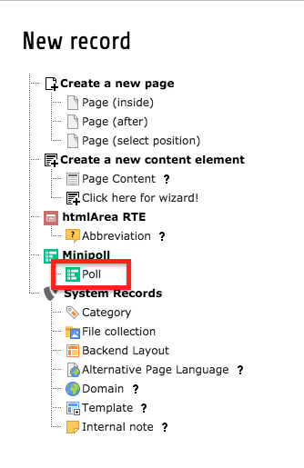
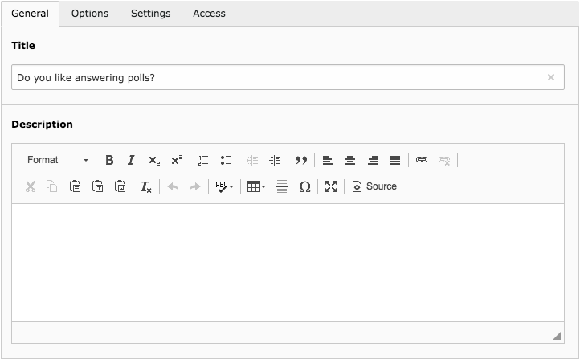
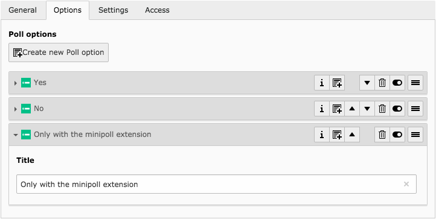
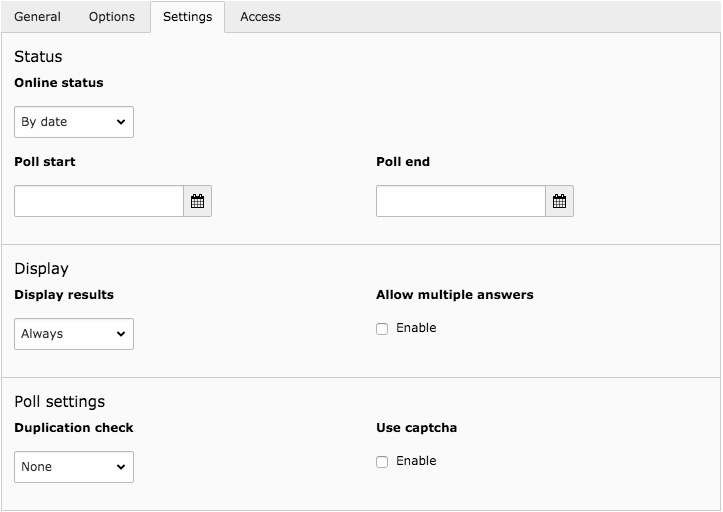

.. include:: ../Includes.txt

.. _section-user-manual:

============
Users Manual
============

.. _section-user-create-poll

Create a poll
=============

Create a new poll record on a page as you would do it with any other record by
selecting it from the avaliable records list:

   Create new poll record (step 1)

   Create new poll record (step 2)

Now you can begin to setup your poll by editing the poll record. Add the
question to the field "Title" in the first place. Additionally you can
(optionally) add a brief description.

   Poll record editing

Next, add the desired options. Go to tab "Options" and click on "Create new Poll
option". As the new option appears, you can give it a title. Repeat this
sequence until your options are complete:

   Poll options editing

That's it, you are basically set with the poll. Now you might tailor the poll's
settings to your needs. Read the following chapter for an explanation of the
possibilities.

.. _section-user-poll-settings

Poll settings
=============

Under the tab "Settings" you'll find, guess what, the poll's settings:

   Poll settings editing

In the following list, the available settings are described.

Online status
   The online status of the poll. The options are:

   * **Closed:** Voting is always closed
   * **Open:** Voting is always active
   * **By date:** Voting is active in between the date/time defined in the
     fields **Poll start** and **Poll end**
   
   .. important::
   
       Do not confuse with "Publish date" and "Expiration date", wich mean to
       completely en-/disable the display of the poll!

Display results
   Define, when the results of the poll are displayed. The options are:
   
   * **Always:** The results can be displayed at any time
   * **After voting:** The results can be displayed after voting (when no
     **Duplication check** is set, this acts like **Always**)
   * **Never:** The results are always hidden

Allow multiple answers
   Allows a participant to select more than one of the possible answers. This
   will render the options as checkboxes instead of radiobuttons.

Duplication check
   How duplicate votes should be tried to be deteced, to ensure, a participant
   does not vote more than once. The options are:
   
   * **IP address:** Identification by IP address. This is very effective, but
     can easily lead to situations, where legtimate votes are rejected. Use with
     caution!
   * **Cookie:** After voting, a participant gets a cookie sent to his browser.
     This method can easily be tricked by just deleting the cookie. This is the
     most common method used in such small polls.
   * **Frontend User:** A vote is linked to the logged in frontend user directly
     in the database. This is the most effective way of restricting to only one
     vote per user. However, you need to setup a frontend login for this to
     work. And: not logged in users will not be allowed to vote at all!
   * **None:**: Duplication checking is completely disabled, every participant 
     can vote as much as she likes.
       
   .. tip::
      
      Developers who might want to implement their own duplication check should
      refer to :ref:`section-developer-duplicationcheck`.

Use captcha
   Add a captcha (https://en.wikipedia.org/wiki/CAPTCHA) to the voting form.
   Note: If no captcha is available for use, this field is not shown at all.
   
   .. important::
   
       This requires a supported captcha extension to be installed and
       configured. See :ref:`ts-plugin-tx-minipoll-captcha` for more
       information.
       
   .. tip::
      
      Developers who might want to implement their own captcha should refer to
      :ref:`section-developer-captcha`.

